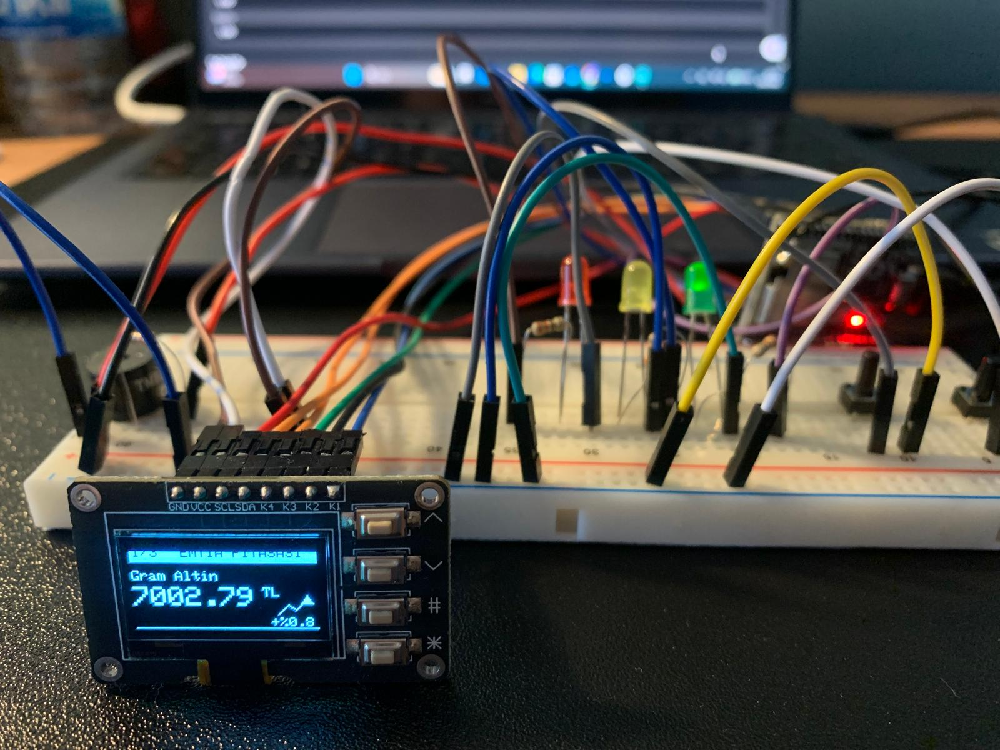
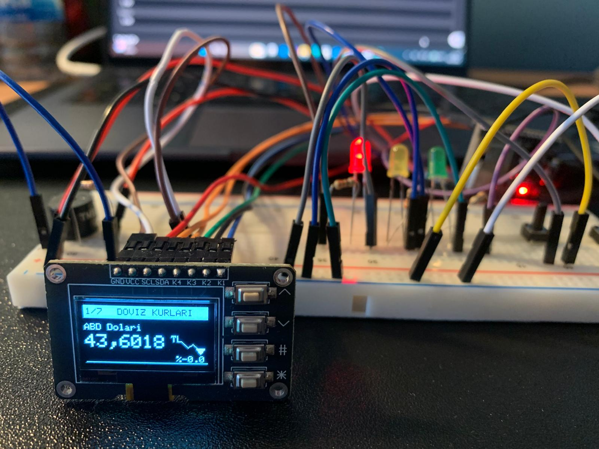

# ESP32 Financial Terminal & Portfolio Tracker

A standalone, IoT-based financial monitoring station developed using the **ESP32** microcontroller. This device tracks real-time market data (Crypto, Stocks/BIST, Forex, Commodities) and calculates total portfolio wealth without requiring a PC or smartphone app.

Unlike simple tickers, this project features an **Embedded Web Server** for managing your portfolio holdings dynamically and utilizes **WiFiManager** for seamless connectivity.

## ✨ Key Features

* **🌍 Quad-Market Tracking:** Monitors **Crypto** (Binance/Global), **BIST 100** (Istanbul Stock Exchange), **Forex** (Currency), and **Commodities** (Gold/Silver/Oil) via CollectAPI.
* **💻 Embedded Web Dashboard:** Features a local HTML interface hosted on the ESP32. You can update your portfolio quantities directly from your browser!
* **💰 Total Wealth Calculator:** Automatically converts all assets to local currency (TRY) and tracks total net worth changes.
* **📶 Smart Connectivity:** Uses **WiFiManager** to create a Captive Portal for easy network setup.
* **🚨 Interactive Alerts:**
    * **RGB LEDs:** Green (Profit), Red (Loss), Yellow (Processing).
    * **Buzzer:** Auditory cues for interactions.
* **💾 Persistent Memory:** Uses ESP32 `Preferences` library to save portfolio data.

## 📸 Gallery

The device displays real-time data on a 0.96" OLED screen.

| **Portfolio Overview** | **Stock Market (BIST)** | **Crypto (Bitcoin)** |
| :---: | :---: | :---: |
|  |  |  |

| **Commodities (Gold)** | **Forex (USD)** |
| :---: | :---: |
|  |  |

## 🛠️ Hardware Required

* **ESP32 Development Board** (WROOM-32)
* **0.96" OLED Display** (I2C)
* **Buzzer** & **3x LEDs**
* **4x Tactile Buttons**

## 🔌 Pin Configuration

| Component | ESP32 GPIO |
| :--- | :--- |
| **OLED SDA** | GPIO 21 |
| **OLED SCL** | GPIO 22 |
| **Red LED** | GPIO 25 |
| **Yellow LED** | GPIO 26 |
| **Green LED** | GPIO 27 |
| **Buzzer** | GPIO 13 |
| **Buttons** | UP:18, DOWN:19, MODE:5, ACTION:4 |

## 🚀 Installation & Setup

1.  **Libraries:** Install `Adafruit_SSD1306`, `ArduinoJson`, `WiFiManager` via Arduino IDE.
2.  **API Key:** Get a free API key from CollectAPI and update the code.
3.  **Upload:** Upload the `.ino` file to your ESP32.
4.  **Setup:** Connect to "ESP32_Borsa_Kurulum" WiFi and configure your settings via the Web Interface.

## 👨‍💻 Author

**Kadircan Peker**
*Electrical & Electronics Engineering Student*
